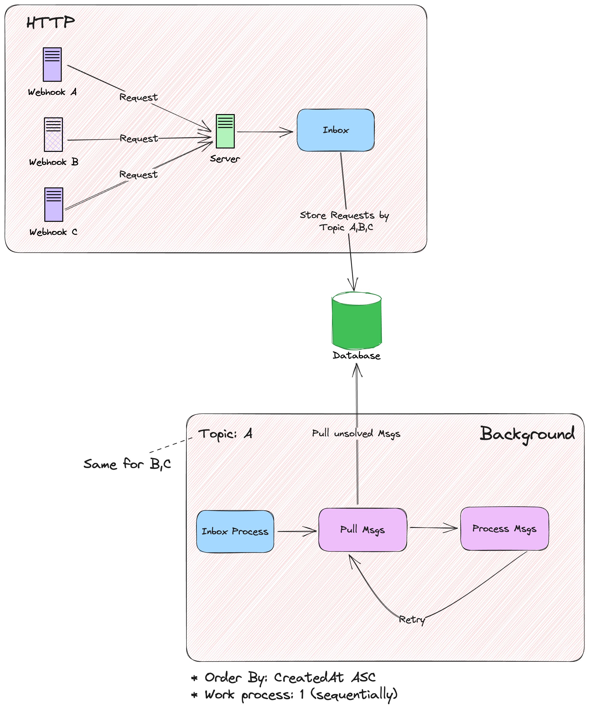

# ShipSaaS - Laravel Inbox Process

[](https://github.com/shipsaas/laravel-inbox-process/actions/workflows/build.yml)
[](https://codecov.io/gh/shipsaas/laravel-inbox-process)

<p align="center">

</p>

Talking about distributed computers & servers, it is quite normal nowadays to communicate between servers.

Unlike a regular conversation though, there's no guarantee the message gets delivered only once, arrives in the right order, or even gets a "got it!" reply.

Thus, we have **Inbox Pattern** to help us to achieve that.

## What is the Inbox Pattern

**The Inbox Pattern** is a popular design pattern in the microservice architecture that ensures:

- High availability ✅
- Guaranteed webhook deliverance, no msg lost ✅
- Guaranteed **exactly-once/unique** webhook requests ✅
- Execute webhook requests **in ORDER/sequence** ✅
- (Optional) High visibility & debug all prev requests ✅

And with that being said:

**Laravel Inbox Process (powered by ShipSaaS)** ships everything out-of-the-box and 
helps you to roll out the inbox process in no time 😎🚀.

## Supports
- Laravel 10+
- PHP 8.2+
- MySQL 8, MariaDB & Postgres 13+

## Architecture Diagram



## Installation

Install the library:

```bash
composer require shipsaas/laravel-inbox-process
```

Export config & migration files and then run the migration:

```bash
php artisan vendor:publish --tag=laravel-inbox-process
php artisan migrate
```

## Documentation & Usage

Visit: [ShipSaaS Inbox Documentation](https://inbox.shipsaas.tech)

Best practices, usage & notes are well documented too 😎!

## Testing

Run `composer test` 😆

Available Tests:

- Unit Testing
- Integration Testing against MySQL & PostgreSQL for the `inbox:work` command
- Human validation (lol)

## Contributors
- Seth Phat

## Contributions & Support the Project

Feel free to submit any PR, please follow PSR-1/PSR-12 coding conventions and testing is a must.

If this package is helpful, please give it a ⭐️⭐️⭐️. Thank you!

## License
MIT License
